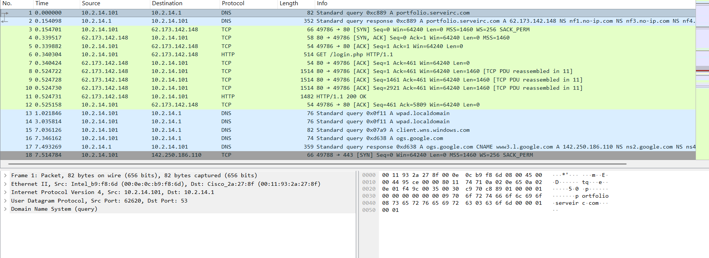

# Day 5: Malware Traffic Analysis - DanaBot PCAP

**Analyst:** Cynthia Ngxitho
**Date:** 2026-04-30
**Scenario:** DanaBot Malware Sample PCAP

## Findings
### 1. DNS Resolution
- Host `10.2.14.101` queried `portfolio.serveirc.com`
- Resolved to C2 IP: `62.173.142.148

### 2. C2 Communication
- HTTP GET to `http://62.173.142.148/login.php
- User-Agent: `DanaBot/3/.2`

## MITRE ATT&CK
- **T1071.001** - Application Layer Protocol: Web
- **T1041** - Exfiltration Over C2 Channel

## Conclusion
Host `10.2.14.101` is compromised. Recommen isolation + block C2 IP at firewall.

