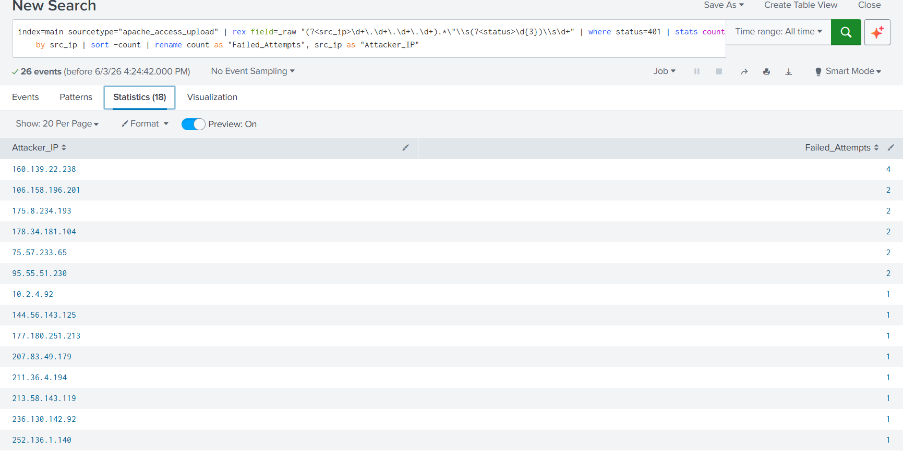
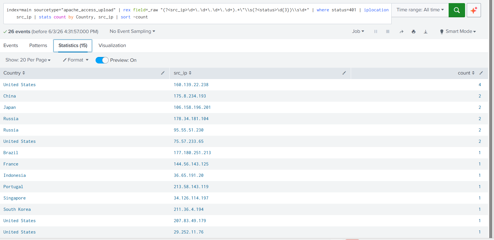

# Week 6 - Brute Force Detection with Splunk

### Project Objective
Detect and analyze HTTP 401 Unauthorized errors to identify brute force/credential stuffing attacks in Apache web server logs.

### Tools Used
- Splunk Enterprise
- SPL - Search Processing Language
- Apache Access Logs

### Data Source
`apache_access_upload` sourcetype. 26 total HTTP 401 events analyzed.

### Key SPL Query
```spl
index=main sourcetype="apache_access_upload"
| rex field=_raw "(?<src_ip>\d+\.\d+\.\d+\.\d+).*\"\\s(?<status>\d{3})\\s\d+"
| where status=401
| stats count by src_ip
| sort -count
| rename count as "Failed_Attempts", src_ip as "Attacker_IP"

### Key Findings
- Total 401 errors detected: 26
- Top attacker IP: 160.139.22.238 with 4 failed attempts  
- Geo location: United States
- Attack pattern: Distributed - multiple IPs with 1-2 attempts each
- MITRE ATT&CK: T1110 - Brute Force

### Visualizations



