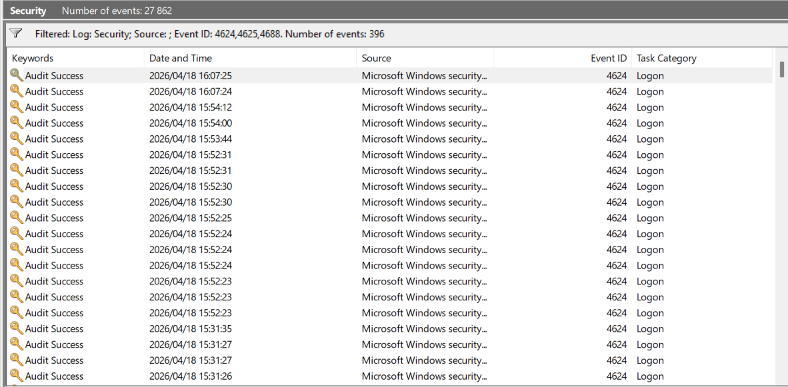

# Week 1: Windows Security Log Analysis

## Objective
Learn to filter and export Windows Event Logs for SOC analysis.

## Method
1. Open Event Viewer → Windows Logs → Security
2. Filter for Event IDs: 4624, 4625, 4688
3. Reduced 27,862 total events to 396 relevant events
4. Exported filtered logs as security_sample.evtx

## Findings
- Event ID 4624: Successful logons. Multiple entries on 2026/04/18 from SYSTEM account.
- No 4625 failed logons visible in sample - indicates no brute force attempts.
- Event ID 4688: Need to check for suspicious process like powershell.exe or cmd.exe

## Screenshots

## Files
-logs/security_sample.evtx - Exported filtered Security log

## SOC Relevance
Filtering Event IDs 4624/4625/4688 is baseline triage for logon anomalies and suspicious process execution. Same workflow used when investigating alerts from SEIM tools like Splunk or Sentinel
