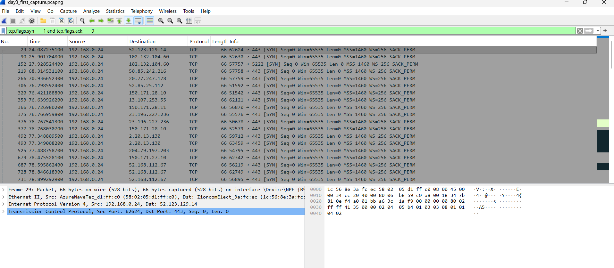

# Day 3: Wireshark Basics

## What I Did
- Installed Wireshark
- Captured live traffic on my interface
- Filtered DNS: `dns`
- Filtered TCP SYN: `tcp.flags.syn == 1`

  ## What I Learned
  - DNS quesries show domains my machine looks up
  - SYN packets are the start of TCP connections
  - Filters cut noise so you see only relevant traffic

    ## Screenshots
    ### DNS Filter
    ![DNS](screenshots/dns_filter.png

    ### SYN Packets
    
